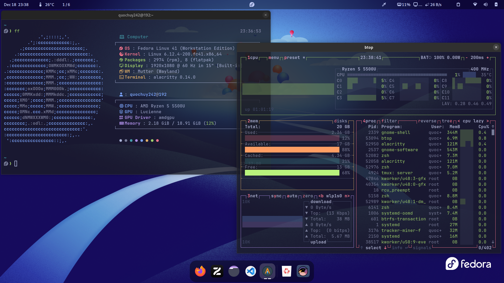

# gnome-ricing



## Install tweaks and gnome-shell-extension

```bash
# For Ubuntu/Debian
sudo apt install gnome-tweaks gnome-shell-extension

# For Fedora
sudo dnf install gnome-tweaks gnome-extension-app

# For Arch-based distro
sudo pacman -S gnome-tweaks gnome-shell-extension
```

## List extension

- ArcMenu
- Blur my Shell
- Caffeine
- Clipbard Indicator
- Color Picker
- Coverflow Alt-Tab
- Dash to Dock
- Freon
- Gnome 4x UI Improvements
- Impatience
- OSD Volume Number
- Search Light
- Top Bar Organizer
- User Themes
- Vitals
- Workspace Indicator

## Dotfiles

You can see my dotfiles [link](https://github.com/quochuy242/dotfiles)

## Other

Font: 
- Monospace: JetBrainsMono Nerd Font
- Interface and Document: Cantarell

Appearance
- Cursor: Bibata Modern Ice
- Icons: Tela circle dracula
- Themes: Tokyo Night
